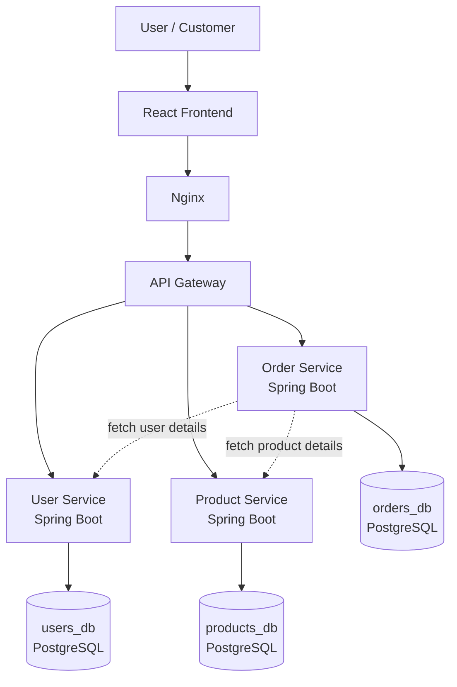

# E-Commerce Microservices Flow

## Notes

- Frontend is served through Nginx.
- All client API calls go through the API Gateway.
- Each Spring Boot service uses its own PostgreSQL database.
- Order Service communicates with User Service and Product Service while placing orders.
